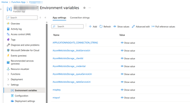
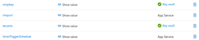

# MISP to Microsoft Sentinel

This code can be used to create an Azure Function that writes threat intelligence from a MISP instance to Microsoft Sentinel. The code is a modified version of [script.py](https://github.com/cudeso/misp2sentinel/blob/main/script.py) in this repository.

## Installation

### Prerequisities
- An Azure Subscription 
- A Microsoft Sentinel Instance
- API and URL of your MISP instance

### Summary

Create an **Azure App** and a **Key Vault**.

1. Create an [Azure App registration](https://portal.azure.com/#view/Microsoft_AAD_RegisteredApps/ApplicationsListBlade) in the same Microsoft tenant where the Sentinel instance resides. 
   * The same steps as in [../../README.md#azure-app-registration](../README.md#azure-app-registration)
   * The Azure App requires **Microsoft Sentinel Contributor** permissions on the workspace.
   * Add an new client secret and note it down
2. Create a [Key Vault](https://portal.azure.com/#browse/Microsoft.KeyVault%2Fvaults) in your Azure subscription
   * If you get *The operation is not allowed by RBAC. If role assignments were recently changed, please wait several minutes for role assignments to become effective* then add yourself as **Key Vault Administrator**
   * Make sure to use **Azure role-based access control (recommended)** as the Permission model (under Settings, Access configuration).
3. Add new secrets to the vault.
   * A new secret with the name `tenants` and the following value (store the value as a string, meaning the JSON blog between quotes)

```json
[
   { 
      "tenantId": "<TENANT_ID_WITH_APP_1>",
      "id": "<APP_ID>",
      "secret": "<APP_SECRET>",
      "workspaceId": "<WORKSPACE_ID>"
   },
   {
      "tenantId": "<TENANT_ID_WITH_APP_N>",
      "id": "<APP_ID>",
      "secret": "<APP_SECRET_N>",
      "workspaceId": "<WORKSPACE_ID_N>"
   }
]
```


   * It's possible to add multiple Sentinel instances, it will loop all occurrences
   * It's possible to add multiple instances of the same tenant, with different workspaceIds', it will loop over each entry
   * Add a new secret with the name `mispkey` and the value of your MISP API key

Once this is done you need to create an **Azure Function** in your Azure subscription, create a managed identity, link it to the function and grant the function access to the Key Vault.

1. Upload the code to your Azure Function. 
   * If you are using VSCode, this can be done by clicking the Azure Function folder and selecting **Deploy to Function App**, provided you have the Azure Functions extension installed. Obviously first clone the project repository locally.
     * 
     * Required roles are
       * **Contributor**
       * **Website Contributor**
   * If using Powershell, you can upload the ZIP file using the following command: `Publish-AzWebapp -ResourceGroupName <resourcegroupname> -Name <functionappname> -ArchivePath <path to zip file> -Force`. If you want to make changes to the ZIP-file, simply send the contents of the `AzureFunction`-folder (minus any `.venv`-folder you might have created) to a ZIP-file and upload that.
   * If using AZ CLI, you can upload the ZIP file using the following command: `az functionapp deployment source config-zip --resource-group <resourcegroupname> --name <functionappname> --src <path to zip file>`.
   * You can also use the [`WEBSITE_RUN_FROM_PACKAGE`](https://learn.microsoft.com/en-us/azure/azure-functions/functions-app-settings#website_run_from_package) configuration setting, which will allow you to upload the ZIP-file to a storage account (or Github repository) and have the Azure Function run from there. This is useful if you want to use a CI/CD pipeline to deploy the Azure Function, meaning you can just update the ZIP-file and have the Azure Function automatically update.
2. Once the Function App is deployed, navigate to Azure [Function Apps](https://portal.azure.com/#browse/Microsoft.Web%2Fsites/kind/functionapp) and select the new Azure Function. Open Settings and then **Environment variables**.
   * 
   * Add a new **Environment variable** named `tenants`. 
     * Create a reference to the vault previously created `@Microsoft.KeyVault(SecretUri=https://<keyvaultname>.vault.azure.net/secrets/tenants/)`.
   * Add a new **Environment variable** named `mispkey`
     * Create a reference to the vault (`@Microsoft.KeyVault(SecretUri=https://<keyvaultname>.vault.azure.net/secrets/mispkey/)`)
   * Add a new **Environment variable** named `mispurl` and add the URL to your MISP-server (`https://<mispurl>`)
   * Add a new **Environment variable** named `misp_event_filters` and set it to a valid JSON object representing the filters to use when querying the MISP server.
   * Add a new **Environment variable** named `timerTriggerSchedule` and set it to run. If you're running against multiple tenants with a big filter, set it to run once every two hours or so. 
     * The `timerTriggerSchedule` takes a cron expression. For more information, see [Timer trigger for Azure Functions](https://learn.microsoft.com/en-us/azure/azure-functions/functions-bindings-timer?tabs=python-v2%2Cin-process&pivots=programming-language-python).
     * Run once every two hours cron expression: `0 */2 * * *`
3. Add a new [Managed Identity](https://portal.azure.com/#browse/Microsoft.ManagedIdentity%2FuserAssignedIdentities).
   * Deploy it in the same resource group and region as your application
4. **Link** the managed identity with your Azure Function. Open the Azure Function, open settings and then **Identity**.
   * Toggle the button to on for **System assigned** and note the ID.
   * Under **User assigned**, click add and select the managed identity you added in the previous step.
5. Now add the **required roles** for the Azure Function to read the secrets from the vault. Access the vault and then choose **Access control (IAM)** from the left menu, then pick Role assignments.
   * Add the System assigned ID from the Azure Function and the managed identity your created earlier and grant them **Key Vault Secrets User**
6. Switch back to the Azure Function, settings, Environment variables. If the Azure Function can access the vault and read the credentials, there should be a green check box next to both of them.
   * 
   * If there is no green check box, then the error should point you in the direction of missing roles/privileges.
     * In my experience, you have to assign the additional roles, remove the environment variable (do not forget to confirm twice), and then add it again. Refreshing the environment variables proved to be very unreliable.

## When does it execute?

The Azure Function will execute as a cron based on the value you specified in `timerTriggerSchedule`.

## Multi-tenant support

If you want to push to multiple Azure tenants using a single app registration, you can accomplish this by making the app a multi tenant app. Customers can then consent to the app in their own tenant using the following url schema: 
 
`https://login.microsoftonline.com/common/adminconsent?client_id=<APP_ID>&sso_reload=true` 
 
This will allow you to add multiple tenants to the `tenants` variable. 
Please note that this will require you to add a redirect URL in the app registrations configuration, like `https://portal.azure.com`.


## Summary of required roles

- Key Vault Administrator
- Contributor
- Website Contributor

## Credits

Credits for this update goes to:

* [cudeso](https://github.com/cudeso/misp2sentinel) for his work on upgrading the original MISP2Sentinel script
* [zolderik](https://github.com/zolderio/misp-to-sentinel/tree/main) for his work on the Azure Function. 
