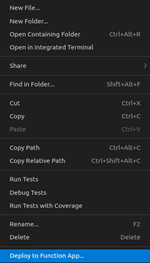
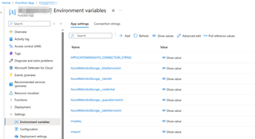
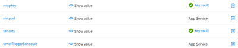
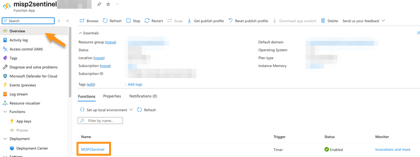
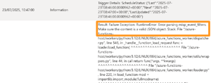

# MISP2Sentinel as an Azure Function

Instead of running `script.py` on a server or alongside MISP, you can deploy MISP2Sentinel as a timer-triggered Azure Function. The function runs on a schedule you define, fetches events from MISP and uploads the resulting indicators to one or more Sentinel workspaces.

For general background on supported indicator types, tag mappings, event filters, network requirements and troubleshooting, see the [main README](../README.md).

## Prerequisites

- An Azure subscription with a Microsoft Sentinel workspace
- An Azure App registration with the **Microsoft Sentinel Contributor** role on the workspace (see [Azure setup](../README.md#1-azure-setup))
- A MISP instance with an API key (see [MISP setup](../README.md#2-misp-setup))

## Installation

### 1. Create a Key Vault

1. Create a [Key Vault](https://portal.azure.com/#browse/Microsoft.KeyVault%2Fvaults) in your Azure subscription.
   - Use **Azure role-based access control** as the permission model (under Settings > Access configuration).
   - If you receive *The operation is not allowed by RBAC*, add yourself as **Key Vault Administrator**.
2. Add the following secrets:
   - **`tenants`**: a JSON array describing one or more Sentinel workspaces (store the value as a plain string):

     ```json
     [
        {
           "tenantId": "<TENANT_ID>",
           "id": "<APP_CLIENT_ID>",
           "secret": "<APP_CLIENT_SECRET>",
           "workspaceId": "<WORKSPACE_ID>"
        }
     ]
     ```

     You can add multiple entries to push indicators to several workspaces. Entries may share the same tenant with different workspace IDs.

   - **`mispkey`**: your MISP API key.

### 2. Deploy the Azure Function

Create a Function App in the Azure portal (or via CLI) and upload the code from the `AzureFunction` folder.

- **VS Code**: right-click the `AzureFunction` folder and choose **Deploy to Function App** (requires the Azure Functions extension).

  

- **PowerShell**: `Publish-AzWebapp -ResourceGroupName <rg> -Name <funcapp> -ArchivePath <path-to-zip> -Force`
- **Azure CLI**: `az functionapp deployment source config-zip --resource-group <rg> --name <funcapp> --src <path-to-zip>`
- **Run from package**: use the [`WEBSITE_RUN_FROM_PACKAGE`](https://learn.microsoft.com/en-us/azure/azure-functions/functions-app-settings#website_run_from_package) setting to have the function load a ZIP from a storage account or repository. This is useful for CI/CD pipelines.

When creating the ZIP, include everything in the `AzureFunction` folder but exclude any `.venv` directory.

Your account needs the **Contributor** and **Website Contributor** roles on the Function App.

### 3. Configure environment variables

Navigate to the Function App in the [Azure portal](https://portal.azure.com/#browse/Microsoft.Web%2Fsites/kind/functionapp), then open Settings > **Environment variables**.



Add the following variables:

| Variable | Value |
|----------|-------|
| `tenants` | Key Vault reference: `@Microsoft.KeyVault(SecretUri=https://<vault>.vault.azure.net/secrets/tenants/)` |
| `mispkey` | Key Vault reference: `@Microsoft.KeyVault(SecretUri=https://<vault>.vault.azure.net/secrets/mispkey/)` |
| `mispurl` | Full URL of your MISP instance, e.g. `https://misp.example.com` |
| `misp_event_filters` | JSON object with the MISP event filters (see [MISP event filters](../README.md#misp-event-filters)). For example: `{"published": 1, "enforceWarninglist": true, "includeEventTags": true, "publish_timestamp": "1d"}` |
| `timerTriggerSchedule` | Cron expression for the schedule, e.g. `0 */2 * * *` (every two hours). See [Timer trigger for Azure Functions](https://learn.microsoft.com/en-us/azure/azure-functions/functions-bindings-timer?tabs=python-v2%2Cin-process&pivots=programming-language-python). |

Click **Apply** and then **Confirm** to save.

### 4. Set up the managed identity

The Function App needs a managed identity so it can read secrets from the Key Vault.

1. Create a [user-assigned managed identity](https://portal.azure.com/#browse/Microsoft.ManagedIdentity%2FuserAssignedIdentities) in the same resource group and region as the Function App.
2. Open the Function App, go to Settings > **Identity**.
   - Under **System assigned**, set Status to **On**. Click **Save** and note the Object (principal) ID.
   - Under **User assigned**, click **Add** and select the identity you created above.
3. In the Key Vault, go to **Access control (IAM)** > **Role assignments**. Grant both the system-assigned identity and the user-assigned identity the **Key Vault Secrets User** role.
4. Back in the Function App under Environment variables, each Key Vault reference should now show a green tick.

   

   If a reference shows an error, verify the role assignments. You may need to remove the environment variable, save, then re-add it. Refreshing in place can be unreliable.

## Configuration

The Azure Function reads its configuration from environment variables and from `config.py` in the `MISP2Sentinel` folder. Most settings have sensible defaults. Refer to the [main README](../README.md#configuration) for a full description of each option.

Key differences from the standalone script:

- **Secrets** are stored in Azure Key Vault rather than in `config.py`.
- **Event filters** are set via the `misp_event_filters` environment variable instead of `config.py`.
- **Multi-tenant support** is built in. The `tenants` secret accepts an array of workspace entries.
- **`new_upload_api`** is set to `True` in `config.py`. This is the only supported upload method. The legacy Graph API (`graph_api`) is deprecated.

## Multi-tenant support

To push indicators to workspaces in different Azure tenants from a single app registration, make the app registration multi-tenant. Customers can then grant consent in their own tenant using:

```
https://login.microsoftonline.com/common/adminconsent?client_id=<APP_CLIENT_ID>&sso_reload=true
```

Add a redirect URI (e.g. `https://portal.azure.com`) to the app registration, then add additional entries to the `tenants` secret.

## Troubleshooting

### Verifying the schedule

The `timerTriggerSchedule` cron expression controls when the function runs. Avoid running it every minute because each execution queries the MISP server and frequent runs create unnecessary load.

To confirm the function is firing, check the **Last used** timestamp next to the API key in MISP (Global Actions > My Profile > Auth Keys). If it remains empty, the function is not executing and you should check the Azure logs.

### Reviewing invocations

1. In the Azure portal, open the Function App and click **Overview**.
2. Under **Functions** you should see **MISP2Sentinel**. If it is missing, redeploy the code.

   

3. Click **MISP2Sentinel**, then **Invocations** to see recent executions.
4. Click a failed invocation to view the error in the Message column.

Common errors:

- **Invalid `misp_event_filters`**: ensure the value is valid JSON.

  


## Summary of required roles

| Role | Where |
|------|-------|
| Key Vault Administrator | Key Vault (for initial setup) |
| Key Vault Secrets User | Key Vault (for the managed identities) |
| Microsoft Sentinel Contributor | Sentinel workspace (for the app registration) |
| Contributor | Function App (for deployment) |
| Website Contributor | Function App (for deployment) |

## Credits

- [cudeso](https://github.com/cudeso/misp2sentinel) for the original MISP2Sentinel script
- [zolderik](https://github.com/zolderio/misp-to-sentinel/tree/main) for the Azure Function implementation
