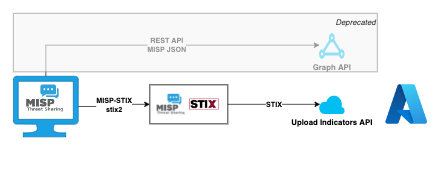
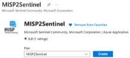
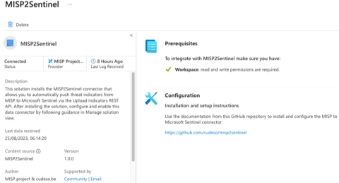
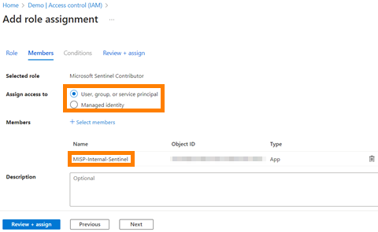
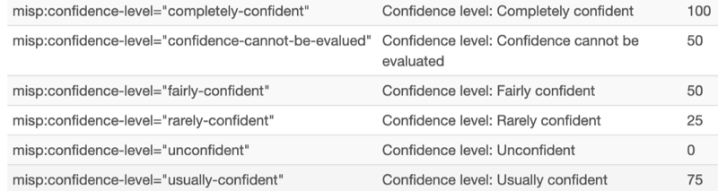
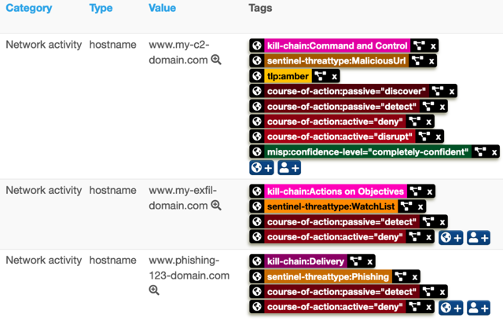
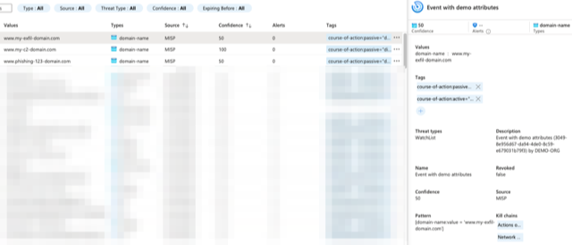
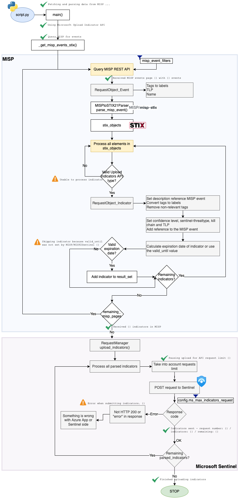

- [MISP to Microsoft Sentinel integration](#misp-to-microsoft-sentinel-integration)
  - [Introduction](#introduction)
    - [Upload Indicators API and Graph API](#upload-indicators-api-and-graph-api)
    - [STIX instead of MISP JSON](#stix-instead-of-misp-json)
    - [Sentinel Workspaces](#sentinel-workspaces)
    - [Microsoft Azure Market Place](#microsoft-azure-market-place)
  - [Installation](#installation)
    - [Azure](#azure)
      - [Azure App registration](#azure-app-registration)
      - [Threat intelligence data connector](#threat-intelligence-data-connector)
      - [Azure Function](#azure-function)
    - [MISP](#misp)
      - [API key](#api-key)
      - [Python environment](#python-environment)
  - [Configuration](#configuration)
    - [Microsoft settings](#microsoft-settings)
    - [MISP settings](#misp-settings)
    - [Azure Key Vault integration (only works on Azure VMs)](#azure-key-vault-integration-only-works-on-azure-vms)
    - [Integration settings](#integration-settings)
  - [Setup](#setup)
    - [Cron job](#cron-job)
  - [Integration details](#integration-details)
    - [MISP taxonomies](#misp-taxonomies)
    - [Attack patterns](#attack-patterns)
    - ["Created by" in Sentinel](#created-by-in-sentinel)
    - [Mappings](#mappings)
      - [Confidence level](#confidence-level)
      - [Sentinel threat type](#sentinel-threat-type)
      - [Kill Chain](#kill-chain)
      - [TLP](#tlp)
      - [Diamond model](#diamond-model)
      - [Threat actors](#threat-actors)
      - [Ignored types](#ignored-types)
      - [Expiration date](#expiration-date)
      - [Attribute mapping](#attribute-mapping)
    - [Detailed workflow for Upload Indicators API](#detailed-workflow-for-upload-indicators-api)
  - [FAQ](#faq)
    - [I don't see my indicator in Sentinel](#i-dont-see-my-indicator-in-sentinel)
    - [I don't see my indicator in Sentinel (2)](#i-dont-see-my-indicator-in-sentinel-2)
    - [I want to ignore the x-misp-object and synchronise all attribute](#i-want-to-ignore-the-x-misp-object-and-synchronise-all-attribute)
    - [Can I get a copy of the requests sent to Sentinel?](#can-i-get-a-copy-of-the-requests-sent-to-sentinel)
    - [Can I get a copy of the response errors returned by Sentinel?](#can-i-get-a-copy-of-the-response-errors-returned-by-sentinel)
    - [An attribute with to\_ids to False is sent to Sentinel](#an-attribute-with-to_ids-to-false-is-sent-to-sentinel)
    - [What is tenant, client\_id and workspace\_id?](#what-is-tenant-client_id-and-workspace_id)
    - [I need help with the MISP event filters](#i-need-help-with-the-misp-event-filters)
    - [What are the configuration changes compared to the old Graph API version?](#what-are-the-configuration-changes-compared-to-the-old-graph-api-version)
    - [I want to limit which tags get synchronised to Sentinel](#i-want-to-limit-which-tags-get-synchronised-to-sentinel)
    - [Error: KeyError: 'access\_token'](#error-keyerror-access_token)
    - [Error: Unable to process indicator. Invalid indicator type or invalid valid\_until date.](#error-unable-to-process-indicator-invalid-indicator-type-or-invalid-valid_until-date)
    - [Which URLs should I whitelist?](#which-urls-should-i-whitelist)
  - [Additional documentation](#additional-documentation)

# MISP to Microsoft Sentinel integration

## Introduction

The MISP to Microsoft Sentinel integration allows you to upload indicators from MISP to Microsoft Sentinel. It relies on **PyMISP** to get indicators from MISP and an **Azure App** to connect to Sentinel. 

### Upload Indicators API and Graph API

The integration supports two methods for sending threat intelligence from MISP to Microsoft Sentinel:

- The recommend [Upload Indicators API](https://learn.microsoft.com/en-us/azure/sentinel/connect-threat-intelligence-upload-api), or
- The [deprecated](https://learn.microsoft.com/en-us/graph/migrate-azure-ad-graph-overview) Microsoft Graph API. To facilitate the transition the integration supports both APIs.

If you were previously using the *old* version of MISP2Sentinel via the Microsoft Graph API then take a moment before upgrading.

- The new integration has different dependencies, for example the Python library [misp-stix](https://github.com/MISP/misp-stix) needs to be installed;
- Your Azure App requires permissions on your workplace;
- There are changes in `config.py`. The most important changes are listed in the FAQ.

### STIX instead of MISP JSON

The change in API also has an impact on how data MISP data is used. The **Graph API** version queries the MISP REST API for results in MISP JSON format, and then does post-processing on the retrieved data. The new **Upload Indicators API** of Microsoft is STIX based. The integration now relies on [MISP-STIX](https://github.com/MISP/misp-stix) a Python library to handle the conversion between MISP and STIX format. For reference, [STIX](https://stixproject.github.io/), is a structured language for describing threat information to make sharing information between systems easier.



From a functional point of view, all indicators that can be synchronised via the Graph API, can also be synchronised via the Upload Indicators API. There are some features missing in the STIX implementation of Sentinel and as a result some context information (identity, attack patterns) is lost. But it is only a matter of time before these are implemented on the Sentinel side, after which you can fully benefit from the STIX conversion.

### Sentinel Workspaces

In addition to the change to STIX, the new API also supports Sentinel **Workspaces**. This means you can send indicators to just one workspace, instead of pushing them globally. Compared to the previous version of MISP2Sentinel there also has been a clean-up of the configuration settings and the integration no longer outputs to stdout, but writes its activity in a **log file**.

### Microsoft Azure Market Place

The [misp2sentinel](https://github.com/cudeso/misp2sentinel) solution is in the Market Place or [Microsoft Sentinel Content Hub](https://portal.azure.com/#create/microsoftsentinelcommunity.azure-sentinel-solution-misp2sentinel) with a corresponding data connector. Note that enabling the solution in Azure isn't sufficient to sync indicators. You still need to setup the *Python environment* or use the *Azure Function*.





## Installation

### Azure

#### Azure App registration

You need to register a new **application** in the Microsoft [Application Registration Portal](https://portal.azure.com/#blade/Microsoft_AAD_IAM/ActiveDirectoryMenuBlade/RegisteredApps).

1. Sign in to the [Application Registration Portal](https://portal.azure.com/#blade/Microsoft_AAD_IAM/ActiveDirectoryMenuBlade/RegisteredApps).
2. Choose **New registration**.
3. Enter an application name, and choose **Register**. The application name does not matter but pick something that's easy recognisable. 
4. From the overview page of your app note the **Application ID** (client) and **Directory ID** (tenant). You will need it later to complete the configuration.
5. Under **Certificates & secrets** (in the left pane), choose **New client secret** and add a description. A new secret will be displayed in the **Value** column. Copy this password. You will need it later to complete the configuration and it will not be shown again.

As a next step, you need to grant the **necessary permissions**. 

For the Graph API:

1. Under **API permissions** (left pane), choose **Add a permission > Microsoft Graph**.
2. Under **Application Permissions**, add **ThreatIndicators.ReadWrite.OwnedBy**.
3. Then grant **consent** for the new permissions via **Grant admin consent for Standaardmap** (*Standaardmap* is replaced with your local tenant setting). Without the consent the application will not have sufficient permissions.

If you plan on using the Upload Indicators API then grant the Azure App **Microsoft Sentinel Contributor** permissions for the workspaces you want to connect to. 

1. Navigate to the Log Analytics Workspace you with to connect to.
2. Select **Access control (IAM)**.
3. Select **Add** > **Add role assignment**.
4. In the **Role** tab, select the **Microsoft Sentinel Contributor** role > **Next**.
5. On the Members tab, select Assign access to > User, group, or service principal.
6. **Select members**. By default, Microsoft Entra applications aren't displayed in the available options. To find your application, search for it by name
7. Then select **Review + assign**.
8. Also take note of the **Workspace ID**. You can get this ID by accessing the Overview page of the workspace.



#### Threat intelligence data connector

After the registration of the app it's time to add a **data connector**.

For the Graph API:

1. Go to the **Sentinel** service.
1. Under **Configuration**, **Data connectors** search for **Threat Intelligence Platforms (Preview)**. Open the connection pane and click connect.

For the Upload Indicators API:

1. Go to the **Sentinel** service.
2. Choose the **workspace** where you want to import the indicators from MISP.
3. Under **Content management**, click on **Content hub** 
4. Find and select the **MISP2Sentinel** solution using the list view
5. Select the **Install/Update** button.

#### Azure Function

**Please note**: This step is optional and replaces the need for running the solution directly on the MISP-server itself, instead chosing to run the script in an Azure Function.

1. Create an app registration in the same Microsoft tenant where the Sentinel instance resides. The app requires Microsoft Sentinel Contributor assigned on the workspace.
2. Create a Keyvault in your Azure subscription
3. Add a new secret with the name "tenants" and the following value (its possible to add multiple Sentinel instances, it will loop all occurences):
```json
[
	{
	    "<TENANT_ID_WITH_APP_1>": {
	      "id": "<APP_ID>",
	      "secret": "<APP_SECRET>",
	      "workspaceid": "<WORKSPACE_ID>"
	    },
	    "<TENANT_ID_WITH_APP_N>": {
	      "id": "<APP_ID>",
	      "secret": "<APP_SECRET_N>",
	      "workspaceid": "<WORKSPACE_ID_N>"
	    }
	}
]
```
4. Add a new secret with the name "mispkey" and the value of your MISP API key
5. Create an Azure Function in your Azure subscription, this needs to be a Linux based Python 3.9 function.
6. Modify config.py to your needs (event filter). 
7. Upload the code to your Azure Function. 
   * If you are using VSCode, this can be done by clicking the Azure Function folder and selecting "Deploy to Function App", provided you have the Azure Functions extension installed.
   * If using Powershell, you can upload the ZIP file using the following command: `Publish-AzWebapp -ResourceGroupName <resourcegroupname> -Name <functionappname> -ArchivePath <path to zip file> -Force`. If you want to make changes to the ZIP-file, simply send the contents of the `AzureFunction`-folder (minus any `.venv`-folder you might have created) to a ZIP-file and upload that.
   * If using AZ CLI, you can upload the ZIP file using the following command: `az functionapp deployment source config-zip --resource-group <resourcegroupname> --name <functionappname> --src <path to zip file>`.
   * You can also use the [`WEBSITE_RUN_FROM_PACKAGE`](https://learn.microsoft.com/en-us/azure/azure-functions/functions-app-settings#website_run_from_package) configuration setting, which will allow you to upload the ZIP-file to a storage account (or Github repository) and have the Azure Function run from there. This is useful if you want to use a CI/CD pipeline to deploy the Azure Function, meaning you can just update the ZIP-file and have the Azure Function automatically update.
8. Add a "New application setting" (env variable) to your Azure Function named `tenants`. Create a reference to the key vault previously created (`@Microsoft.KeyVault(SecretUri=https://<keyvaultname>.vault.azure.net/secrets/tenants/)`).
9. Do the same for the `mispkey` secret (`@Microsoft.KeyVault(SecretUri=https://<keyvaultname>.vault.azure.net/secrets/mispkey/)`)
10. Add a "New application setting" (env variable) called `mispurl` and add the URL to your MISP-server (`https://<mispurl>`)
11. Add a "New application setting" (env variable) `timerTriggerSchedule` and set it to run. If you're running against multiple tenants with a big filter, set it to run once every two hours or so. 
   * The `timerTriggerSchedule` takes a cron expression. For more information, see [Timer trigger for Azure Functions](https://learn.microsoft.com/en-us/azure/azure-functions/functions-bindings-timer?tabs=python-v2%2Cin-process&pivots=programming-language-python).
   * Run once every two hours cron expression: `0 */2 * * *`

For a more in-depth guidance, check out the [INSTALL.MD](https://github.com/cudeso/misp2sentinel/blob/main/docs/INSTALL.MD) guidance, or read [Use Update Indicators API to push Threat Intelligence from MISP to Microsoft Sentinel](https://www.infernux.no/MicrosoftSentinel-MISP2SentinelUpdate/).

### MISP

#### API key

The MISP2Sentinel integrations requires access to the MISP REST API and you need an API key to access it. 

Create the key under **Global Actions**, **My Profile** and then choose **Auth keys**. Add a new key. The key can be set to *read-only* as the integration does not alter MISP data.

#### Python environment

You then need **Python3**, a Python virtual environment and PyMISP.

1. Verify you have `python3` installed on your system
2. Download the repository `git clone https://github.com/cudeso/misp2sentinel.git`
4. Go to directory `cd misp2sentinel`
3. Create a virtual environment `virtualenv sentinel` and activate the environment `source sentinel/bin/activate`
4. Install the Python dependencies `pip install -r requirements.txt` 

## Configuration

The configuration is handled in the `config.py` file.

By default the config.py will look to use Azure Key Vault if configured, if you set a **"key_vault_name"** value in your environment variables, to the name of the Azure Key Vault you have deployed, this will be the default store for all secret and configuration values.

If you do not set the above value, the config.py will then fall-back to using environment variables and lastly, values directly written inside of the config.py file.

[Guidance for assigning a Management Service Indeitity to Function App](https://learn.microsoft.com/en-us/azure/app-service/overview-managed-identity?tabs=portal%2Chttp)

[Assigning your function app permissions to Azure Key Vault](https://learn.microsoft.com/en-us/azure/key-vault/general/assign-access-policy?tabs=azure-portal) - **NOTE** - you only need to assign "Secret GET" permission to your function app Management Service Identity.

### Microsoft settings

First define the Microsoft authentication settings in the dictionary **ms_auth**. The `tenant` (Directory ID), `client_id` (Application client ID), and `client_secret` (secret client value) are the values you obtained when setting up the Azure App. You can then choose between the Graph API or the recommended Upload Indicators API. To use the former : set `graph_api` to True and choose as `scope` 'https://graph.microsoft.com/.default'. To use the Upload Indicators API, set `graph_api` to False, choose as `scope` 'https://management.azure.com/.default' and set the workspace ID in `workspace_id`.
  
```
ms_auth = {
    'tenant': '<tenant>',
    'client_id': '<client_id>',
    'client_secret': '<client_secret>',
    'graph_api': False,                                # Set to False to use Upload Indicators API    
    #'scope': 'https://graph.microsoft.com/.default',  # Scope for GraphAPI
    'scope': 'https://management.azure.com/.default',  # Scope for Upload Indicators API
    'workspace_id': '<workspace_id>'
}
```

Next there are settings that influence the interaction with the Microsoft Sentinel APIs.

The settings for the **Graph API** are
- `ms_passiveonly = False`: Determines if the indicator should trigger an event that is visible to an end-user. 
  - When set to ‘true,’ security tools will not notify the end user that a 'hit' has occurred. This is most often treated as audit or silent mode by security products where they will simply log that a match occurred but will not perform the action. This setting no longer exists in the Upload Indicators API.
- `ms_action = 'alert` : The action to apply if the indicator is matched from within the targetProduct security tool.
  - Possible values are: unknown, allow, block, alert. This setting no longer exists in the Upload Indicators API.

The settings for the **Upload Indicators API** are
- `ms_api_version = "2022-07-01"`: The API version. Leave this to "2022-07-01".
- `ms_max_indicators_request = 100`: Throttling limits for the API. Maximum indicators that can be send per request. Max. 100.
- `ms_max_requests_minute = 100`: Throttling limits for the API. Maximum requests per minute. Max. 100.

```
ms_passiveonly = False              # Graph API only
ms_action = 'alert'                 # Graph API only

ms_api_version = "2022-07-01"       # Upload Indicators API version
ms_max_indicators_request = 100     # Upload Indicators API: Throttle max: 100 indicators per request
ms_max_requests_minute = 100        # Upload Indicators API: Throttle max: 100 requests per minute
```

### MISP settings

Set `misp_key` to your MISP API key and `misp_domain` to the URL of your MISP server. You can also specify if the script should validate the certificate of the misp instance with `misp_verifycert` (usually relevant for self-signed certificates)

```
misp_key = '<misp_api_key>'
misp_domain = '<misp_url>'
misp_verifycert = False (by default this is False, however this is determined by an environment variable set "local_mode", see config.py
```

The dictionary `misp_event_filters` defines which filters you want to pass on to MISP. This applies to both Graph API and Upload Indictors API. The suggested settings are
- `"published": 1`: Only include events that are published
- `"tags": [ "workflow:state=\"complete\""]`: Only events with the workflow state 'complete'
- `"enforceWarninglist": True`: Skip indicators that match an entry with a warninglist. This is highly recommended, but obviously also depends on if you have enable MISP warninglists.
- `"includeEventTags": True`: Include the tags from events for additional context
- `"publish_timestamp": "14d`: Include events published in the last 14 days

Although it might be tempting to keep `publish_timestamp` to 14 days, it's better to only use the 14 (or higher) days for the initial run. Afterwards set the publish_timestamp to a value that's equal to the frequency you synchronise with Sentinel. Meaning, if you sync every 12 hours, set the publish_timestamp to 12h. It has no additional value to search for older events, as these have already been published previously.

There's one MISP filter commonly used that does not have an impact for this integration: **to_ids**. In MISP `to_ids` defines if an indicator is *actionable* or not. Unfortunately the REST API only supports the to_ids filter when querying for attributes. This integration queries for events. Does this mean that indicators with to_ids set to False are uploaded? No. In the Graph API version, only attributes with to_ids set to True are used. The Upload Indicators API relies on the MISP-STIX conversion of attributes (and objects). This conversion checks for the to_ids flag for indicators, the only exception being attributes part of an object (also see [#48](https://github.com/MISP/misp-stix/issues/48)).

```
misp_event_filters = {
    "published": 1,
    "tags": [ "workflow:state=\"complete\""],
    "enforceWarninglist": True,
    "includeEventTags": True,
    "publish_timestamp": "14d",
}
```

There's one additional setting for the Upload Indicators API and that's `misp_event_limit_per_page`. This setting defines how many events per search query are processed. Use this setting to limit the memory usage of the integration.

- `misp_event_limit_per_page = 50`

### Azure Key Vault integration (only works on Azure VMs)

To avoid having secrets in cleartext saved, you can integrate with an Azure Key Vault.
1. Enable a managed identity for the virtual machine
2. Create an Azure Key Vault
3. Create the secrets `MISP-Key` and `ClientSecret` in the secrets tab
4. Give the virtual machine managed identity access to the `Reader` role on the Azure Key Vault
5. Give the same managed identity `Get` and `List` secret actions in the Access Policy
6. Make sure to run installation of `requirements.txt` again, as this requires two new libraries:
   * azure-keyvault-secrets
   * azure-identity

The rest of the configuration is done in `config.py`:

```python
# Code for supporting storage of secrets in key vault (only works for VMs running on Azure)
import os
from azure.keyvault.secrets import SecretClient
from azure.identity import DefaultAzureCredential

# Key vault section
# Key Vault name must be a globally unique DNS name
keyVaultName = "<unique-name>"
KVUri = f"https://{keyVaultName}.vault.azure.net"

# Log in with the virtual machines managed identity
credential = DefaultAzureCredential()
client = SecretClient(vault_url=KVUri, credential=credential)

# Retrieve values from KV (client secret, MISP-key most importantly)
retrieved_mispkey = client.get_secret('MISP-Key')
retrieved_clientsecret = client.get_secret('ClientSecret')
```

1. Firstly, uncomment the lines in `config.py` so it matches the above
2. Make sure the variable `keyVaultName` is set to the name of the key vault you set up earlier (this is also a good time to double check that the managed identity has the correct access to the KV)
3. Replace the value for the `misp_key` variable:
   ```
   misp_key = retrieved_mispkey.value
   ```
4. Replace the value for the `client_secret` variable in the `ms_auth`-blob:
   ```
   'client_secret': retrieved_clientsecret.value
   ```

### Integration settings

The remainder of the settings deal with how the integration is handled.

**Ignore local tags and network destination**

These settings only apply for the Graph API:

- `ignore_localtags = True `: When converting tags from MISP to Sentinel, ignore the MISP local tags (this applies to tags on event and attribute level).
- `network_ignore_direction = True`: When set to true, not only store the indicator in the "Source/Destination" field of Sentinel (`networkDestinationIPv4, networkDestinationIPv6 or networkSourceIPv4, networkSourceIPv6`), also map in the fields without network context (`networkIPv4,networkIPv6`).

```
ignore_localtags = True             
network_ignore_direction = True     # Graph API only
```

**Indicator confidence level**

- `default_confidence = 50`: The default confidence level of indicators. This is a value between 0 and 100 and is used by both the Graph API and Upload Indicators API. You can set a confidence level per indicator, but if you don't set one then this default value is used.
  - This value is **overridden** when an attribute is tagged with the *MISP confidence level* ([MISP taxonomy](https://www.misp-project.org/taxonomies.html#_misp)). The tag is translated to a numerical confidence value (defined in `MISP_CONFIDENCE` in `constants.py`). It's possible to have more fine-grained confidence levels by adjusting the MISP taxonomy and simply adding entries to the predicate 'confidence-level'.



```
default_confidence = 50             # Sentinel default confidence level of indicator
```

**Days to expire indicator**

These settings apply to both the Graph API and Upload Indicators API.

- `days_to_expire = 50`: The default number of days after which an indictor in Sentinel will expire. 

For the Graph API the date is calculated based on the timestamp when the script is executed. 

The expiration of indicators works slightly different for the Upload Indicators API. There are two additional settings that apply for this API:
- `days_to_expire_start`: Define if you want to start counting the "expiration" date (defined in `days_to_expire`) from the current date (with `current_date`) or from the value specified by MISP (with `valid_from`).
- `days_to_expire_mapping`: Is a dictionary mapping specific expiration dates for indicators (STIX patterns). The numerical value is in days. This value overrides `days_to_expire`.

```
days_to_expire = 50                 # Graph API and Upload Indicators
days_to_expire_start = "current_date" # Upload Indicators API only. Start counting from "valid_from" | "current_date" ; 
days_to_expire_mapping = {          # Upload indicators API only. Mapping for expiration of specific indicator types
                    "ipv4-addr": 150,
                    "ipv6-addr": 150,
                    "domain-name": 300,
                    "url": 400,
                }
```

In MISP you can set the *first seen* and *last seen* of attributes. In the MISP-STIX conversion, last seen is translated to *valid_until*. This valid_until influences the expiration date of the indicator. If the expiration date (calculated with the above values) is after the current date, then it is ignored. In some cases it can be useful to ignore the last seen value set in MISP, and just use your own calculations of the expiration date. You can do this with `days_to_expire_ignore_misp_last_seen`. This ignores the last seen value, and calculates expiration date based on `days_to_expire` (and _mapping).

In summary. 
- If valid_until is set in MISP
	- Set expire to valid_until
- Else
  - If days_to_expire_start == current_date
  	- Set expire to "now" + days from either days_to_expire or days_to_expire_mapping
  - If days_to_expire_start == valid_from
  	- Set expire to MISP valid _ from + days from either days_to_expire or days_to_expire_mapping

**Script output**

This version of MISP2Sentinel writes its output to a log file (defined in `log_file`).

If you're using the Graph API you can output the POST JSON to a log file with `write_post_json = True`. A similar option exist for the Upload Indicators API. With `write_parsed_indicators = True` it will output the parsed value of the indicators to a local file.

With `verbose_log = True` you can increase the verbosity setting of the log output.

```
log_file = "/tmp/misp2sentinel.log"
write_post_json = False             # Graph API only
verbose_log = False
write_parsed_indicators = False      # Upload Indicators only
```

**Whitelisted URLS**

The list of URLs which need to be whitelisted are summarised under [Which URLs should I whitelist?](#which-urls-should-i-whitelist)

## Setup 

### Cron job

It is best to prepare and deploy the cron job with user www-data.

```
# Sentinel
00 5 * * * cd /home/misp/misp2sentinel/ ; /home/misp/misp2sentinel/sentinel/bin/python /home/misp/misp2sentinel/script.py
```

## Integration details

### MISP taxonomies

To make the most of the Sentinel integration you have to enable these MISP taxonomies:

- [MISP taxonomy](https://www.misp-project.org/taxonomies.html#_misp)
- [sentinel-threattype](https://www.misp-project.org/taxonomies.html#_sentinel_threattype)
- [kill-chain](https://www.misp-project.org/taxonomies.html#_kill_chain)
- [diamond-model](https://www.misp-project.org/taxonomies.html#_diamond_model) *(only used with Graph API)*

These taxonomies are used to provide additional **context** to the synchronised indicators and are strictly not necessary for the well-functioning of the integration. But they provide useful information for Sentinel users to understand what the threat is about and which follow-up actions need to be taken. 

### Attack patterns

The attack patterns ([TTPType](https://stixproject.github.io/data-model/1.2/ttp/TTPType/) and others) are *not yet implemented by Microsoft*. This means that information from Galaxies and Clusters (such as those from MITRE) added to events or attributes are included in the synchronisation. Once there is full STIX support from Microsoft these attack patterns will be imported.

### "Created by" in Sentinel

The "Created by" field refers to the UUID of the organisation that created the event in MISP. The [identity](https://stixproject.github.io/documentation/idioms/identity/) concept is not yet implemented on the Sentinel side. It is in the STIX export from MISP but as identity objects are not yet created in Sentinel, the reference is only a textual link to the MISP organisation UUID.

### Mappings






#### Confidence level

The numerical value from the tags of the confidence level in the ([MISP taxonomy](https://www.misp-project.org/taxonomies.html#_misp)) are translated to the indicator confidence level.

#### Sentinel threat type 

You can identify the Sentinel threat type on event and attribute level with the taxonomy [sentinal-threattype](https://www.misp-project.org/taxonomies.html#_sentinel_threattype). The Graph API translates the tags from the **sentinal-threattype** taxonomy to the [Sentinel](https://learn.microsoft.com/en-us/graph/api/resources/tiindicator?view=graph-rest-beta#threattype-values) values for `threattype`. In STIX (and thus also for the Upload Indicators API) there is no sentinal-threattype. In this case the integration translates the indicators to [indicator_types](https://stixproject.github.io/data-model/1.2/indicator/IndicatorType/), which the Sentinel interface then represents under Threat type.

#### Kill Chain

The [Kill Chain tags](https://www.misp-project.org/taxonomies.html#_kill_chain) are translated by the Graph API to the [Kill Chain values of Microsoft](https://learn.microsoft.com/en-us/graph/api/resources/tiindicator?view=graph-rest-beta#killchain-values). Note that Sentinel uses C2 and Actions instead of "Command and Control" and "Actions on Objectives". The Upload Indicators API translates them to the [STIX](https://stixproject.github.io/documentation/idioms/kill-chain/) Kill Chain entities. In addition, the integration for the Upload Indicators API will also translate the MISP category into a Kill Chain.

#### TLP

The TLP (Traffic Light Protocol) tags of an event and attribute are translated to the STIX markers. If there's a TLP set on the attribute level then this takes precedence. If no TLP is set (on event or attribute), then **tlp-white** is applied (set via `SENTINEL_DEFAULT_TLP`.)

#### Diamond model

The Graph API translates the tags from the **diamond-model** taxonomy to [Sentinel](https://learn.microsoft.com/en-us/graph/api/resources/tiindicator?view=graph-rest-beta#diamondmodel-values). properties for `diamondModel`. The Diamond model is not used by the Upload Indicators API.

#### Threat actors

The Graph API translates the MISP attributes **threat-actor** to Sentinel properties for `activityGroupNames`. The MISP attributes **comment** are added to the Sentinel `description`. This is not used by the Upload Indicators API. Future versions of the Microsoft API will support attack patterns etc.

#### Ignored types

Only indicators of type `stix` are used, as such the attributes of type `yara` or `sigma` are not synchronised.

#### Expiration date

For the Upload Indicators API:
- If the attribute type is in `days_to_expire_mapping`, use the days defined in the mapping
- If the there is no mapping, then use the default `days_to_expire`
- Start counting from today if `days_to_expire_start` is "current_date" (or from the "valid_from" time)
- If the end count date is beyond the date set in "valid_until", then discard the indicator

The `valid_until` value is set in MISP with the `last_seen` of an attribute. Depending on your use case you might want to ignore the `last_seen` of an attribute, and consequently ignore the  `valid_until` value. Do this by setting the configuration option `days_to_expire_ignore_misp_last_seen` to True.

```
days_to_expire_ignore_misp_last_seen = True
```

#### Attribute mapping

The attribute type matchings are defined in `constants.py`. 

```
ATTR_MAPPING = {
    'AS': 'networkSourceAsn',
    'email-dst': 'emailRecipient',
    'email-src-display-name': 'emailSenderName',
    'email-subject': 'emailSubject',
    'email-x-mailer': 'emailXMailer',
    'filename': 'fileName',
    'malware-type': 'malwareFamilyNames',
    'mutex': 'fileMutexName',
    'port': 'networkPort',
    'published': 'isActive',
    'size-in-bytes': 'fileSize',
    'url': 'url',
    'user-agent': 'userAgent',
    'uuid': 'externalId',
    'domain': 'domainName',
    'hostname': 'domainName'
}
```

There are also special cases covered in other sections of the Python code.

```
MISP_SPECIAL_CASE_TYPES = frozenset([
    *MISP_HASH_TYPES,
    'url',
    'ip-dst',
    'ip-src',
    'domain|ip',
    'email-src',
    'ip-dst|port',
    'ip-src|port'
])
```

- ip-dst and ip-src
- - mapped to either `networkDestinationIPv4`, `networkDestinationIPv6` or `networkSourceIPv4`, `networkSourceIPv6`
- - if the configuration value `network_ignore_direction` is set to true then the indicator is also mapped to `networkIPv4`,`networkIPv6`
- domain|IP
- - Mapped to a domain and an IP `domainName`
- - An IP without a specification of a direction `networkIPv4`, `networkIPv6`
- email-src
- - Mapped to a sender address `emailSenderAddress`
- - And to a source domain `emailSourceDomain`
- ip-dst|port and ip-src|port
- - apped to either `networkDestinationIPv4`, `networkDestinationIPv6` or `networkSourceIPv4`, `networkSourceIPv6`
- - if the configuration value `network_ignore_direction` is set to true then the indicator is also mapped to `networkIPv4`, `networkIPv6`
- - The port is mapped to `networkSourcePort`, `networkDestinationPort`
- - if the configuration value `network_ignore_direction` is set to true then the indicator is also mapped to `networkPort`
- url
- - MISP URL values that do not start with http or https or changed to start with http. Azure does not accept URLs that do not start with http

The supported hashes are defined in the set `MISP_HASH_TYPES`.


### Detailed workflow for Upload Indicators API

The integration workflow is as follows:

- `script.py`
  - The `main` function starts the request for the MISP events via `_get_misp_events_stix()`
  - In `_get_misp_events_stix()` the MISP REST API is queried for events matching your search queries (defined in `misp_event_filters`)
  - This REST API returns a **paged** result in **JSON** format
    - **DEBUG**: If you get the message `Received MISP events page {} with {} events` in the log then the script was successful in querying MISP events
    - The function loops through the events, as long as the result set is not empty. 
      - If it is empty, then `remaining_misp_pages` is set to False, exiting the loop
      - If you provided a limit in `misp_event_filters`, then events are queried in one go
      - Note that the MISP REST API supports returning STIX2 format, but at the time of development the API didn't handle requests for non-existing pages (pages with a result set of 0 events; the API does not return the number of pages, so you have to query until the result set is 0)
      - This was raised as a bug report with [issue 44](https://github.com/MISP/misp-stix/issues/44) in misp-stix and solved with [MISP/MISP@18fd906](https://github.com/MISP/MISP/commit/18fd906e52065e8a46b06c420c562d957459d639)
        - On the roadmap withissue [issue 52](https://github.com/cudeso/misp2sentinel/issues/52)
  - In `RequestObject_Event` the event tags are converted to tags, the event name is set and a TLP is set
  - For each event, it will **parse and convert the JSON to STIX** with `MISPtoSTIX21Parser` with the function `parse_misp_event()` (this is part of misp-stix)
  - This conversion returns **stix_objects**. If the conversion returns errors, the script will continue. The reason is that we want the upload to continue, even if the conversion for one event fails.
    - **DEBUG** You can track these errors with the message `Error when processing data in event {} from MISP {}`
  - It then loops through the stix objects
    - Only valid types for uploading to the Upload Indicators API are considered
      - An invalid type is ignored and processing continues
      - For example indicators of type YARA are ignored, but other indicators in the event should still be processed
    - For each indicator, the class `RequestObject_Indicator` is instantiated
      - This sets the description to refer to the event
      - Converts the MISP tags to labels, removing some of the non-relevant tags
      - Adds the confidence level
      - Sets the sentinel-threattype, kill chain and tlp labels
      - Adds a reference to the MISP event
      - Sets the expiration date of the attribute
    - Only if there is a valid expiration date of the indicator (either calculated or set in the threat event), the indicator is considered
      - Errors are logged with `Skipping indicator because valid_until was not set by MISP/MISP2Sentinel {}`
    - Valid indicators are added to the list `result_set`
  - When all indicators are processed, it logs `Processed {} indicators` (if debug is set to True)
  - When all remaining pages with results are processed, it logs `Received {} indicators in MISP`
  - Then `upload_indicators()` from `RequestManager` is called
    - At this stage the script will start interacting with Microsoft Sentinel. All actions before this step are "local", related to MISP
    - It takes into account the upload limits. If it needs to wait an message is logged with `Pausing upload for API request limit {}`.    
  - It starts processing all `processed_indicators`
    - Uploads are done in batches of `config.ms_max_indicators_request` indicators
    - A POST request is done to Microsoft Sentinel
      - If the HTTP status code is not 200, or if the "error" key is in the response then something went wrong. This is logged with `Error when submitting indicators. {}`.
        - An error indicates the Azure App does not have sufficient permissions, or that something on the receiving (Sentinel) side is not OK.
      - If the request was successful, it logs this with `Indicators sent - request number: {} / indicators: {} / remaining: {}`
  - When it's done, it will log `Finished uploading indicators`



## FAQ

### I don't see my indicator in Sentinel

- Is the event published?
- Is the to_ids flag set to True?
- Is the indicator stored in a valid attribute type (`UPLOAD_INDICATOR_MISP_ACCEPTED_TYPES`)?

### I don't see my indicator in Sentinel (2)

If you are using the new Upload Indicators API then the integration with Sentinel relies on [https://github.com/MISP/misp-stix](https://github.com/MISP/misp-stix). The MISP attributes and objects are transformed to STIX objects. After that, only the `indicators` (defined in `UPLOAD_INDICATOR_API_ACCEPTED_TYPES`) are synchronised with Sentinel. As a consequence, if the conversion by MISP-STIX does not translate MISP attributes or objects to STIX objects, then the value does not get synchronised with Sentinel.

Almost all MISP objects are translated, but there can be situations where the MISP object is not recognised. It is then translated to `x-misp-object` and not to an `indicator` STIX object. Elements from `x-misp-object` are not synchronised. If you run into this situation then open an issue with [https://github.com/MISP/misp-stix](https://github.com/MISP/misp-stix). Examples in the past include the [hashlookup object](https://github.com/MISP/misp-stix/issues/56).

This little Python snippet can help you find out if elements are correctly translated. Adjust `misp_event_filters` to query only for the event with a non-default object.

```
misp = PyMISP(config.misp_domain, config.misp_key, config.misp_verifycert, False)
misp_page = 1
config.misp_event_limit_per_page = 100
result = misp.search(controller='events', return_format='json', **config.misp_event_filters, limit=config.misp_event_limit_per_page, page=misp_page)
misp_event=result[0]
parser = MISPtoSTIX21Parser()
parser.parse_misp_event(misp_event)
stix_objects = parser.stix_objects
for el in stix_objects:
    print(el.type)
    if el.type == 'indicator':
        print(el)
```
 
### I want to ignore the x-misp-object and synchronise all attribute

 When the option `misp_flatten_attributes` is set to **True**, the script extracts all attributes that are part of MISP objects and adds them as “atomic” attributes. You lose some contextual information (although the integration adds a comment to the attribute that it used to be part of an object) when you set this to True, but you are then sure that all attributes that can be translated to indicators in STIX are synchronised.

### Can I get a copy of the requests sent to Sentinel?

When you use the **Upload Indicators API** you can print the STIX package sent to Microsoft Sentinel by setting `write_parsed_indicators` to True. This writes all packages to `parsed_indicators.txt`. This file is overwritten at each execution of the script.

### Can I get a copy of the response errors returned by Sentinel?

When you use the **Upload Indicators API** you can print the errors returned by Sentinel by setting `sentinel_write_response` to True. This writes the response strings from Microsoft Sentinel that contain an "error" key to `sentinel_response.txt`.

### An attribute with to_ids to False is sent to Sentinel

With the Upload Indicators API the conversion to STIX2 is done with misp-stix. Unfortunately the current version does not take into account the to_ids flag set on attributes in objects. See [#48](https://github.com/MISP/misp-stix/issues/48).

### What is tenant, client_id and workspace_id?

- `tenant` is the Directory ID. Get get it by searching for **Tenant Properties** in Azure
- `client_id` is Application client ID. Get it by listing the **App Registrations** in Azure and using the column Application (client) ID
- `workspace_id` is the workspace ID. Get it by opening the Log Analytics workspace and the Workspace ID in the Essentials overview

### I need help with the MISP event filters

The blog post [Figuring out MISP2Sentinel Event Filters](https://www.infernux.no/MISP2Sentinel-EventFilters/) can help you defining the `misp_event_filters`. If you want to be more granular with time based filters then take a look at the MISP playbook [Using timestamps in MISP](https://github.com/MISP/misp-playbooks/blob/main/misp-playbooks/pb_using_timestamps_in_MISP-with_output.ipynb). And lastly, have a look at the different [MISP Open API specifications](https://www.misp-project.org/openapi/#tag/Events/operation/restSearchEvents) for the event search.

### What are the configuration changes compared to the old Graph API version?

| Old | New |
|-----|-----|
| graph_auth  | ms_auth (now requires a 'scope') |
| targetProduct  | ms_target_product (Graph API only) |
| action | ms_action (Graph API only) |
| passiveOnly | ms_passiveonly (Graph API only)|
| defaultConfidenceLevel | default_confidence |
| | ms_api_version (Upload indicators) |
| | ms_max_indicators_request (Upload indicators) |
| | ms_max_requests_minute (Upload indicators) |
| | misp_event_limit_per_page (Upload indicators) |
| | days_to_expire_start (Upload indicators) |
| | days_to_expire_mapping (Upload indicators) |
| | days_to_expire_ignore_misp_last_seen (Upload indicators) |
| | log_file (Upload indicators) |
| | misp_remove_eventreports (Upload indicators) |
| | sentinel_write_response (Upload indicators) |

Have a look at [_init_configuration()](https://github.com/cudeso/misp2sentinel/blob/main/script.py#L145) for all the details.

### I want to limit which tags get synchronised to Sentinel

You can control the list of tags that get synchronised with variables in the `constants.py` file.

- **MISP_TAGS_IGNORE** : A list of **tags to ignore**. This list now contains the default tags that are set automatically as "labels" during the conversion by MISP to STIX. You can add your own list here.
- **MISP_ALLOWED_TAXONOMIES** : The list of **allowed taxonomies**. This means that if a tag is not part of the taxonomy (technically, if it does not start with `taxonomy:`), then it is ignored. If you leave the value empty then all taxonomies / tags are included. For example use `["tlp", "admiralty-scale", "type"]`

### Error: KeyError: 'access_token'

This error occurs when the client_id, tenant, client_secret or workspace_id are invalid. Check the values in the Azure App.

### Error: Unable to process indicator. Invalid indicator type or invalid valid_until date.

If the error is followed with the message `Ignoring non STIX pattern type yara` then this means that there’s an indicator type that’s not accepted by Sentinel, in this case **yara**.

### Which URLs should I whitelist?

The MISP2Sentinel requires access to a number of web resources.

- MISP
  - HTTPS access to your MISP server, either via localhost (127.0.0.1) or from remote
- HTTPS access to these Azure resources
  - sentinelus.azure-api.net
  - login.microsoftonline.com
  - graph.microsoft.com/.default
  - management.azure.com

## Additional documentation

* [https://www.vanimpe.eu/2022/04/20/misp-and-microsoft-sentinel/](https://www.vanimpe.eu/2022/04/20/misp-and-microsoft-sentinel/)
* [https://techcommunity.microsoft.com/t5/microsoft-sentinel-blog/integrating-open-source-threat-feeds-with-misp-and-sentinel/ba-p/1350371](https://techcommunity.microsoft.com/t5/microsoft-sentinel-blog/integrating-open-source-threat-feeds-with-misp-and-sentinel/ba-p/1350371)
* https://learn.microsoft.com/en-us/graph/api/tiindicators-list?view=graph-rest-beta&tabs=http
* [Microsoft Graph Security Documentation](https://developer.microsoft.com/en-us/graph/docs/concepts/security-concept-overview)
* [Microsoft Graph Explorer](https://developer.microsoft.com/en-us/graph/graph-explorer)
* [https://github.com/cudeso/misp2sentinel/blob/main/docs/INSTALL.MD](https://github.com/cudeso/misp2sentinel/blob/main/docs/INSTALL.MD)
* [https://www.infernux.no/MicrosoftSentinel-MISP2SentinelUpdate/](https://www.infernux.no/MicrosoftSentinel-MISP2SentinelUpdate/)
* [Microsoft code samples](https://developer.microsoft.com/en-us/graph/code-samples-and-sdks)
* [MISP to Microsoft Graph Security connector](https://www.circl.lu/doc/misp/connectors/#misp-to-microsoft-graph-security-script)
