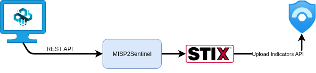
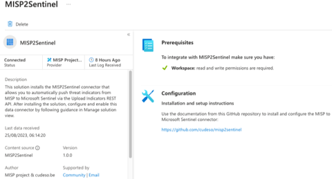
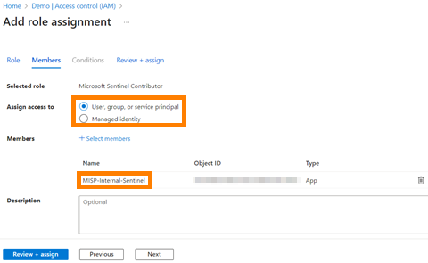
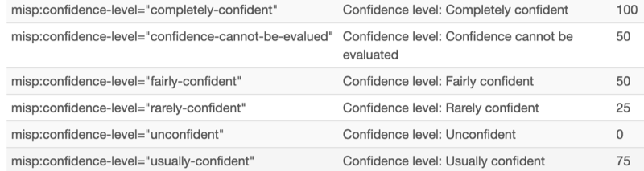
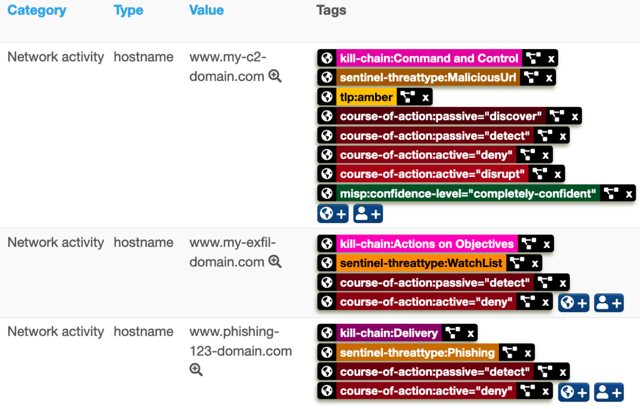
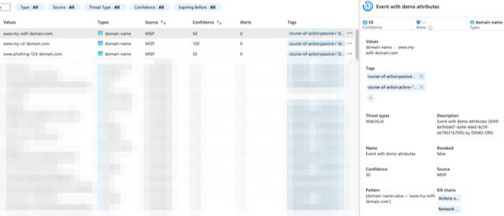
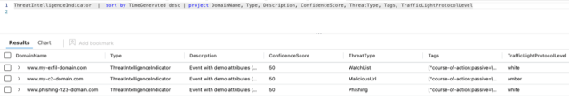

# MISP to Microsoft Sentinel

## Introduction

MISP2Sentinel uploads threat intelligence indicators from a [MISP](https://www.misp-project.org/) instance to [Microsoft Sentinel](https://learn.microsoft.com/en-us/azure/sentinel/). It uses the [STIX objects upload API](https://learn.microsoft.com/en-us/azure/sentinel/stix-objects-api) (`https://api.ti.sentinel.azure.com`) to push indicators in STIX 2.1 format.

The script queries MISP for events via [PyMISP](https://github.com/MISP/PyMISP), converts the attributes to STIX indicator objects and sends them to Sentinel in batches. Indicators appear in the Sentinel Threat Intelligence blade and can be used in analytics rules, hunting queries and workbooks.



MISP2Sentinel is also available through the [Microsoft Sentinel Content Hub](https://portal.azure.com/#create/microsoftsentinelcommunity.azure-sentinel-solution-misp2sentinel).



## Prerequisites

- **Python 3** (3.10 or later recommended)
- A running **MISP** instance with API access
- An **Azure tenant** with a Microsoft Sentinel workspace
- An **Azure App registration** with the Microsoft Sentinel Contributor role

## Installation

### 1. Azure setup

#### Register an Azure App

Register a new application in the Microsoft [Application Registration Portal](https://portal.azure.com/#blade/Microsoft_AAD_IAM/ActiveDirectoryMenuBlade/RegisteredApps).

1. Sign in to the [Application Registration Portal](https://portal.azure.com/#blade/Microsoft_AAD_IAM/ActiveDirectoryMenuBlade/RegisteredApps).
2. Choose **New registration**.
3. Enter an application name and choose **Register**.
   
4. Note the **Application (client) ID** and the **Directory (tenant) ID**.
5. Under **Manage** > **Certificates & secrets**, choose **New client secret** and add a description. Copy the secret value straight away; it will not be shown again.

#### Assign permissions

The Azure App needs the **Microsoft Sentinel Contributor** role on each workspace you want to connect to.

1. Navigate to the **Log Analytics workspace** you wish to connect to.
2. Select **Access control (IAM)**.
3. Select **Add** > **Add role assignment**.
4. In the **Role** tab, select **Microsoft Sentinel Contributor** > **Next**.
5. On the **Members** tab, select **Assign access to** > **User, group, or service principal**.
6. Click **Select members**. Microsoft Entra applications are not shown by default, so search for your application by name.
7. Select **Review + assign**.
8. Take note of the **Workspace ID**. You can find it on the **Overview** page of the workspace.



#### Install the data connector

1. Go to the **Sentinel** service in the Azure portal.
2. Choose the **workspace** where you want to import indicators.
3. Under **Content management**, click **Content hub**.
4. Find and select the **MISP2Sentinel** solution.
5. Click **Install/Update**.

#### Azure Function (optional)

Instead of running the script on a server or alongside MISP, you can run it as an Azure Function. See [AzureFunction/README.MD](AzureFunction/README.MD) for instructions.

### 2. MISP setup

#### API key

MISP2Sentinel needs an API key to read events from MISP. Create one under **Global Actions** > **My Profile** > **Auth keys**. The key can be set to *read-only* because the integration does not modify any MISP data.

### 3. Python environment

1. Verify that `python3` is installed on your system.
2. Clone the repository:
   ```
   git clone https://github.com/cudeso/misp2sentinel.git
   cd misp2sentinel
   ```
3. Create and activate a virtual environment:
   ```
   virtualenv sentinel
   source sentinel/bin/activate
   ```
4. Install the dependencies:
   ```
   pip install -r requirements.txt
   ```

## Configuration

All settings live in `config.py`. Copy the provided `config.py.default` to `config.py` and fill in the values described below.

If you set the environment variable **`key_vault_name`** to the name of your Azure Key Vault, the script will attempt to read secrets from there first. Otherwise it falls back to environment variables and finally to the values in `config.py` itself.

### Microsoft settings

The `ms_auth` dictionary holds the connection details for Sentinel. Fill in the `tenant` (Directory ID), `client_id` (Application client ID), `client_secret` (secret value) and `workspace_id` from the Azure setup steps above.

`new_upload_api` **must** be set to `True`. This is the only supported upload method going forward; the legacy Graph API has been deprecated by Microsoft and will be removed in a future release.

```python
ms_auth = {
    'tenant': '<tenant>',
    'client_id': '<client_id>',
    'client_secret': '<client_secret>',
    'new_upload_api': True,
    'scope': 'https://management.azure.com/.default',
    'workspace_id': '<workspace_id>',
}
```

### API settings

```python
ms_api_version = "2024-02-01-preview"
ms_max_indicators_request = 100     # Maximum indicators per request (max 100)
ms_max_requests_minute = 100        # Maximum requests per minute (max 100)
```

- `ms_api_version`: The STIX objects API version. Leave this at `"2024-02-01-preview"`.
- `ms_max_indicators_request`: How many indicators to include in a single API call. The API allows at most 100.
- `ms_max_requests_minute`: How many API calls to make per minute. The API allows at most 100. Combined, these settings give a maximum throughput of roughly 10,000 indicators per minute.

### MISP settings

```python
misp_key = '<misp_api_key>'
misp_domain = '<misp_url>'
misp_verifycert = False
```

- `misp_key`: The MISP API key you created earlier.
- `misp_domain`: The full URL of your MISP instance, for example `https://misp.example.com`.
- `misp_verifycert`: Set to `True` if your MISP instance uses a trusted TLS certificate, or `False` to skip certificate validation (common with self-signed certificates).

### MISP event filters

The `misp_event_filters` dictionary controls which MISP events are fetched. Recommended settings:

```python
misp_event_filters = {
    "published": 1,
    "tags": [ "workflow:state=\"complete\""],
    "enforceWarninglist": True,
    "includeEventTags": True,
    "publish_timestamp": "14d",
}
```

- `"published": 1` fetches only published events.
- `"tags"` lets you restrict to events with specific tags, such as a workflow state.
- `"enforceWarninglist": True` skips indicators that match a MISP warninglist entry. This is strongly recommended, but depends on your warninglists being enabled.
- `"includeEventTags": True` carries event-level tags over to individual indicators, giving them more context in Sentinel.
- `"publish_timestamp": "14d"` fetches events published in the last 14 days.

**A note on `publish_timestamp`**: use 14 days (or more) for the initial run so that you backfill your Sentinel workspace. After that, **set this value to match your synchronisation frequency**. If you run the script every 12 hours, set it to `"12h"`. There is no benefit in re-fetching older events that have already been uploaded.

### Pagination

```python
misp_event_limit_per_page = 100
```

This setting controls how many events are fetched per MISP query. Lower it if the script consumes too much memory.

### Indicator expiry

```python
days_to_expire = 50
days_to_expire_start = "valid_from"   # "valid_from" or "current_date"
```

- `days_to_expire`: Number of days after which an indicator expires in Sentinel.
- `days_to_expire_start`: Whether the expiry is calculated from the indicator's `valid_from` timestamp or from the current date.

You can override the expiry per indicator type using `days_to_expire_mapping`:

```python
days_to_expire_mapping = {
    "ipv4-addr": 1,
    "ipv6-addr": 1,
    "domain-name": 1,
    "url": 1,
    "file:hashes": 1,
}
```

If `days_to_expire_ignore_misp_last_seen` is set to `True` (the default), the script ignores the `last_seen` value from MISP and always calculates expiry using `days_to_expire`. Set it to `False` to honour the MISP `last_seen` date where available.

### Confidence

```python
default_confidence = 50
```

Sets the default STIX confidence value (0-100) for indicators. This can be overridden per indicator through MISP tags that use the `misp-confidence` taxonomy.

### Other settings

```python
sourcesystem = "MISP"               # Source system name sent to Sentinel
verbose_log = False                 # Enable debug-level logging
log_file = "misp2sentinel.log"      # Path to the log file
dry_run = False                     # Process indicators without uploading them
write_parsed_indicators = False     # Write parsed indicators to parsed_indicators.txt
write_parsed_eventid = False        # Log event IDs being processed
sentinel_write_response = False     # Write Sentinel API responses to sentinel_response.txt
remove_pipe_from_misp_attribute = True  # Strip composite attributes (e.g. filename|sha256) to the first value
ignore_localtags = True             # Skip MISP tags marked as local
misp_flatten_attributes = True      # Flatten MISP object attributes into the event attribute list
misp_remove_eventreports = True     # Remove event reports from MISP events before processing
ms_useragent = "MISP-1.0"           # User-Agent header sent to the Sentinel API
ms_check_if_exist_in_sentinel = False   # Check if an indicator already exists in Sentinel before uploading
```

- `write_parsed_eventid`: When set to `True`, the script logs the event IDs it processes. Useful for debugging which events are being picked up by the filters.
- `misp_remove_eventreports`: When set to `True`, event reports attached to MISP events are stripped before processing. Defaults to `True`.
- `ms_useragent`: The User-Agent string sent with API requests. Defaults to `"MISP-1.0"`.
- `ms_check_if_exist_in_sentinel`: When set to `True`, the script checks whether each indicator already exists in Sentinel before uploading. This avoids duplicates but adds an API call per indicator, which slows down the synchronisation. Requires `subscription_id`, `resourceGroupName` and `workspaceName` in `ms_auth` (see the [deleting indicators](#deleting-indicators-from-sentinel) section).

## Running the script

Make sure the virtual environment is active, then run:

```
python script.py
```

You can also process a single MISP event by passing its UUID:

```
python script.py <event-uuid>
```

### Verifying your configuration

Use `check-config.py` to test connectivity to both MISP and Azure before running the main script:

```
python check-config.py
```

This will attempt to authenticate against MISP (and fetch one event) and obtain an access token from Azure, reporting any issues.

### Scheduling

To keep Sentinel up to date, schedule the script with cron (Linux) or Task Scheduler (Windows). For example, to run every hour:

```
0 * * * * cd /path/to/misp2sentinel && sentinel/bin/python script.py
```

## Azure Key Vault integration (optional)

If you run the script on an Azure VM, you can store secrets in Azure Key Vault instead of keeping them in `config.py`.

1. Enable a managed identity for the virtual machine.
2. Create an Azure Key Vault.
3. Add the secrets `MISP-Key` and `ClientSecret` in the Key Vault secrets tab.
4. Give the VM's managed identity the `Reader` role on the Key Vault.
5. Give the same managed identity `Get` and `List` permissions in the Key Vault access policy.
6. Make sure the Key Vault libraries are installed (they are included in `requirements.txt`):
   - `azure-keyvault-secrets`
   - `azure-identity`

Then uncomment and configure the Key Vault section in `config.py`:

```python
import os
from azure.keyvault.secrets import SecretClient
from azure.identity import DefaultAzureCredential

keyVaultName = "<unique-name>"
KVUri = f"https://{keyVaultName}.vault.azure.net"

credential = DefaultAzureCredential()
client = SecretClient(vault_url=KVUri, credential=credential)

retrieved_mispkey = client.get_secret('MISP-Key')
retrieved_clientsecret = client.get_secret('ClientSecret')
```

After that, update the relevant variables to use the retrieved values:

```python
misp_key = retrieved_mispkey.value
```

```python
'client_secret': retrieved_clientsecret.value
```

## Integration details

### MISP taxonomies

To get the most out of the Sentinel integration, enable the following MISP taxonomies:

- [MISP taxonomy](https://www.misp-project.org/taxonomies.html#_misp) (used for confidence levels)
- [sentinel-threattype](https://www.misp-project.org/taxonomies.html#_sentinel_threattype) (mapped to STIX `indicator_types`)
- [kill-chain](https://www.misp-project.org/taxonomies.html#_kill_chain) (mapped to STIX kill chain phases)

These taxonomies are not required for the integration to work, but they add useful context for analysts working with the indicators in Sentinel.

### How tags are mapped

#### Confidence level

The default confidence value (set in `default_confidence`) can be overridden per indicator using the MISP confidence taxonomy. The tag is translated to a numerical value as defined by `MISP_CONFIDENCE` in `constants.py`.



#### Sentinel threat type

You can tag events or attributes with the [sentinel-threattype](https://www.misp-project.org/taxonomies.html#_sentinel_threattype) taxonomy. The integration maps these tags to STIX [indicator_types](https://stixproject.github.io/data-model/1.2/indicator/IndicatorType/), which Sentinel displays as the threat type.

#### Kill chain

[Kill chain tags](https://www.misp-project.org/taxonomies.html#_kill_chain) are translated to STIX kill chain phases following the Lockheed Martin Cyber Kill Chain model.

#### TLP

TLP (Traffic Light Protocol) tags on events and attributes are translated to STIX marking definitions. An attribute-level TLP takes precedence over an event-level TLP. If no TLP tag is set at all, `tlp:white` is applied by default (configurable via `SENTINEL_DEFAULT_TLP` in `constants.py`).







### Controlling which tags are synchronised

You can control which tags get synchronised using two variables in `constants.py`:

- **`MISP_TAGS_IGNORE`**: A list of tag prefixes to exclude. It already contains the default tags added during STIX conversion, but you can extend it with your own entries.
- **`MISP_ALLOWED_TAXONOMIES`**: A list of allowed taxonomy prefixes. Only tags belonging to these taxonomies will be included. Leave the list empty to allow all taxonomies. For example: `["tlp", "admiralty-scale", "type"]`.

### Supported indicator types

Only attributes with a STIX pattern type are synchronised. Attributes of type `yara` or `sigma`, for instance, are skipped. The list of accepted MISP attribute types is defined by `UPLOAD_INDICATOR_MISP_ACCEPTED_TYPES` in `constants.py`.

### "Created by" in Sentinel

The "Created by" field in Sentinel refers to the UUID of the MISP organisation that created the event. Because Sentinel does not yet fully support STIX identity objects, this appears as a textual reference rather than a linked entity.

### Flattening object attributes

When `misp_flatten_attributes` is set to `True`, the script extracts all attributes from MISP objects and treats them as standalone attributes. This means you lose some contextual information (although a comment is added noting which object the attribute belonged to), but it ensures that every attribute that can be converted to a STIX indicator is synchronised.

## Network access

MISP2Sentinel needs outbound HTTPS access to the following hosts:

- Your MISP server
- `login.microsoftonline.com` (Azure authentication)
- `api.ti.sentinel.azure.com` (STIX objects upload API)
- `management.azure.com` (used by `delete-from-azure.py` and the "check if exists" feature)

## Troubleshooting

### My indicator does not appear in Sentinel

Check the following:

- Is the MISP event **published**?
- Is the `to_ids` flag set to `True` on the attribute?
- Is the attribute type one of the supported types (listed in `UPLOAD_INDICATOR_MISP_ACCEPTED_TYPES` in `constants.py`)?
- Has the `valid_until` date already passed? Expired indicators are skipped.

### Error: KeyError: 'access_token'

This means the Azure authentication failed. Double-check that `tenant`, `client_id`, `client_secret` and `workspace_id` are correct.

### How do I find the tenant, client_id and workspace_id?

- **`tenant`** is the Directory (tenant) ID. Search for *Tenant Properties* in the Azure portal.
- **`client_id`** is the Application (client) ID. Find it under *App Registrations* in the Azure portal.
- **`workspace_id`** is the Workspace ID shown on the *Overview* page of your Log Analytics workspace.

### Getting copies of requests and responses

- Set `write_parsed_indicators = True` to write the STIX indicators sent to Sentinel to `parsed_indicators.txt`. This file is overwritten on each run.
- Set `sentinel_write_response = True` to write error responses from Sentinel to `sentinel_response.txt`.

### Help with MISP event filters

- The blog post [Figuring out MISP2Sentinel Event Filters](https://www.infernux.no/MISP2Sentinel-EventFilters/) walks through common filter configurations.
- The MISP playbook [Using timestamps in MISP](https://github.com/MISP/misp-playbooks/blob/main/misp-playbooks/pb_using_timestamps_in_MISP-with_output.ipynb) explains time-based filters in detail.
- The [MISP OpenAPI specification](https://www.misp-project.org/openapi/#tag/Events/operation/restSearchEvents) for event search documents all available filter parameters.

## Additional resources

- [MISP and Microsoft Sentinel](https://www.vanimpe.eu/2022/04/20/misp-and-microsoft-sentinel/)
- [Integrating open source threat feeds with MISP and Sentinel](https://techcommunity.microsoft.com/t5/microsoft-sentinel-blog/integrating-open-source-threat-feeds-with-misp-and-sentinel/ba-p/1350371)
- [MISP2Sentinel update](https://www.infernux.no/MicrosoftSentinel-MISP2SentinelUpdate/)
- [Microsoft Sentinel STIX objects API](https://learn.microsoft.com/en-us/azure/sentinel/stix-objects-api)

