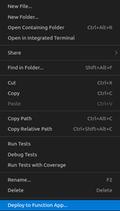

# MISP to Microsoft Sentinel integration
### Step-by-Step Azure Function Setup with Azure Key Vault integration

This step-by-step instruction guides you through the process of setting up a complete Azure Function that will acquire Threat Intelligence from a MISP source, sanitize it, then writes it to 1 or multiple Microsoft Sentinel instances. It relies on **PyMISP** to get indicators from MISP and an **Azure App** to connect to Sentinel.

### STIX

The integration relies on [MISP-STIX](https://github.com/MISP/misp-stix) to handle the conversion between MISP and STIX format.

### Microsoft Azure Market Place

[misp2sentinel](https://github.com/cudeso/misp2sentinel) is available in the Microsoft Market Place or [Microsoft Sentinel Content Hub](https://portal.azure.com/#create/microsoftsentinelcommunity.azure-sentinel-solution-misp2sentinel)

### READ ME
> This guide was originally written by [zolderik](https://github.com/zolderio/misp-to-sentinel/blob/main/INSTALL.md) and previously updated by [pensivepaddle](https://github.com/pensivepaddle). I've ([celsovidal](https://github.com/celsovidal)) made some updates to reflect what I had done in order to get the function app working as of **August 2025**. All original work can be found here: (https://github.com/cudeso/misp2sentinel/tree/main)

The complete setup consists of several Azure components:

1. **App Registration** - This app will get the permissions to write data to the ThreatIndicatores table of Sentinel
2. **Key Vault** - contains the keys to automatically authenticate with the app registration
3. **Function** - contains the scripts to retrieve information from a MISP source in interval, rewrite it to useful data and than place it in Sentinel through the app registration
4. **OPTIONAL - NAT Gateway** - Optional component allowing the Azure Function to connect to MISP from a fixed IP-address, allowing it to be added to an access control list that might be protecting the MISP server

## Prerequisities

- An Azure Subscription 
- A Microsoft Sentinel Instance
- API and URL of your MISP instance
- [Threat Intelligence Solution installed](https://learn.microsoft.com/nb-no/azure/sentinel/connect-threat-intelligence-upload-api#enable-the-threat-intelligence-upload-indicators-api-data-connector-in-microsoft-sentinel) on the Microsoft Sentinel workspace

## MISP

#### API key

The MISP2Sentinel integrations requires access to the MISP REST API and you need an API key to access it. Create the key under **Global Actions**, **My Profile** and then choose **Auth keys**. Add a new key. The key can be set to *read-only* as the integration does not alter MISP data.

## App Registration

This is how to create and configure the app registration:

1. Open Azure via https://portal.azure.com
2. Go to the service App Registrations
3. Make a new registration
4. Give the new app a descriptive name, for instance: *misp2sentinel*. Other settings can be left to default values.
5. Click ofter creating the app registration in the overview page under Client credentials on *add a certificate or secret*
6. Click under Client secrets on *New client secret*
7. Give a description, for instance *M2S Azure Function* and leave the recommeded expiry value
8. Copy the value of the new Client Secret, which need to be stored in an Azure Key Vault
9. [Add the created app registration to the Microsoft Sentinel Contributor role](https://learn.microsoft.com/nb-no/azure/sentinel/connect-threat-intelligence-upload-api#assign-a-role-to-the-application) on the relevant workspaces.

#### Required information to store for use later on.

- **TENANT_ID** = the value stated at _Directory (tenant) ID_ in the App Registration overview
- **APP_ID** = the value stated at _Application (client) ID_ in the App Registration overview
- **APP_SECRET** = the value you copied in the last step in creating the App Registration
- **WORKSPACE_ID** = the workspace id of the Sentinel workspace you want to write to

#### Making the App Registration multi-tenant

To make the app registration work in the other tenants you will need to grant admin consent to the enterprise app in each tenant. Please note that this will require you to add a redirect URL in the app registrations configuration, like `https://portal.azure.com`.

1. In each tenant you wish to push data to, navigate to the following URL and click accept to add the enterprise app to the tenant:
   `https://login.microsoftonline.com/common/adminconsent?client_id=<APP_ID>&sso_reload=true` 
2. Add the enterprise application to the Microsoft Sentinel Contributor role on each workspace you wish to push data to.

> **NOTE**: It might be a good idea to set the enterprise application in the native Azure AD tenant to not allow users to sign in.

#### Formatting the Secret value

From above App Registration, 4 elements are required to store in Keyvault a value in the correct format to make the script able to properly make use of the app.

The combined value that should be stored in the Keyvault, is as follows, where the variable names including the <> should be replaced by above 3 values.

```json
[ {"tenantId":"<TENANT_ID_WITH_APP>", "id": "<APP_ID>", "secret": "<APP_SECRET>", "workspaceId": "<WORKSPACE_ID>"} ]
```

The format of the key value makes it possible for the Azure Function to write Threat Intel data to multiple Sentinel instances. This is useful for instance if there is a testing environment, or for any other reason multiple Sentinel instances exist.

For pushing to multiple Sentinel instances, you would format the secret as such:

```json
[
   { 
      "tenantId": "<TENANT_ID_WITH_APP_1>",
      "id": "<APP_ID>",
      "secret": "<APP_SECRET>",
      "workspaceId": "<WORKSPACE_ID>"
   },
   {
      "tenantId": "<TENANT_ID_WITH_APP_N>",
      "id": "<APP_ID>",
      "secret": "<APP_SECRET_N>",
      "workspaceId": "<WORKSPACE_ID_N>"
   }
]
```

> **NOTE**: The solution currently does not support pushing to multiple workspaces within the same tenant, as the tenant id is used as the key in the dictionary.

## Key Vault

This is how to create a Key Vault and store the secret value in it:

1. Go to the service *Key vaults*
2. Click *Create key vault*
3. Configure the Key vault as you wish, pay attention to the region in which it is stored, for instance "West Europe"

#### Adding secrets to the Key Vault

From above App Registration, 4 elements are required to store in Keyvault a value in the correct format to make the script able to properly make use of the app.

1. After creating the Key vault, under Objects click Keys and create a new key
2. Enter the values that were copied from App Registration Secrets above
- the name of the key **MUST** be `tenants`
- The *Secret Value* will be the formatted secret value you created in the [Formatting the Secret value](https://github.com/celsovidal/misp2sentinel-revamp-/blob/main/docs/INSTALL.MD#formatting-the-secret-value) section.
- Other settings can be left to default values
3. Add a new secret `MISP-Key` with the value of the API key of your MISP instance.
4. Add a new secret `ClientSecret` with the value as the App Secret you created from the App Registration as well.


## Function

This is how the create the Azure Function app.

#### Create the Azure Function in the Azure Portal

1. Go to the service *Function App*
2. Click *Create* to generate a new Azure Function
- Give the function a descriptive name
- Choose at Publish for *Code*, and *Python* as the Runtime Stack. Again pay attention to the Region ("West Europe")
- OS can remain Linux
- At plan type choose *App service plan*
- Other settings can be left to default values. Click *Review + Create*
3. After the creation of the Azure Function, add a [system managed identity to the Azure Function](https://learn.microsoft.com/EN-us/azure/app-service/overview-managed-identity?toc=%2Fazure%2Fazure-functions%2Ftoc.json&tabs=portal%2Chttp#add-a-system-assigned-identity). This will be used to authenticate with the Key Vault.
4. Go to the Key Vault and click on *Access policies*
5. Click on *Add Access Policy*
6. Select the *Secret permissions* tab and choose *Get* and *List* from the options
7. Select the *Select principal* tab and search for the name of the Azure Function
8. Click *Add* and *Save*
9. Go back to the Azure Function, select `Access Control`> `Add role assignment` > `Privileged administrator roles` and select *Contributor*. Select next and assign yourself and then select *Review + assign*. 
10. Go back to  `Access Control`> `Add role assignment` and under *Job function roles*, select *Website Contributor* and assign yourself.
11. Go back to the Azure Function, select *Settings* and click on *Environment variables*
12. Add a new application setting with the name `tenants` and the Key Vault reference string `@Microsoft.KeyVault(SecretUri=https://<keyvaultname>.vault.azure.net/secrets/tenants/)`
13. Add a new application setting with the name `mispkey` and the Key Vault reference string `@Microsoft.KeyVault(SecretUri=https://<keyvaultname>.vault.azure.net/secrets/MISP-Key/)`
14. Add a new application setting with the name `mispurl` and the value of the URL of your MISP instance
15. Add a new application setting with the name `timerTriggerSchedule`
   * The `timerTriggerSchedule` takes a cron expression. For more information, see [Timer trigger for Azure Functions](https://learn.microsoft.com/en-us/azure/azure-functions/functions-bindings-timer?tabs=python-v2%2Cin-process&pivots=programming-language-python).
   * Run once every two hours cron expression: `0 */2 * * *`
16. Add a new application setting with the name `key_vault_name` and the value of *JUST* the name of the key vault.
17. Add a new application setting with the name `AzureFunctionsJobHost__functionTimeout` and set the value to `00:10:00` if using the consumption plan, or `02:00:00` if using premium or dedicated plans. This setting is required to prevent the function from timing out when processing large amounts of data.

> **NOTE: Double check that the Function App is running on Python 3.10 by going to `Settings` > `Configuration` > `General settings` and look at the **Python Version** section. If it doesn't says **Pyhton 3.10**, select the dropdown and change. You will have to restart your Function App afterwards. 

## VSCode Prep and Upload

> **NOTE: These instructions are based on editing code in Windows OS. If you are on MAC, some of these steps will vary.

#### Download VSCode and Python3
1. Verify you have python3 (specifically version 3.10) installed on your system. If not download and install [python 3.10](https://www.python.org/downloads/release/python-31018/)
2. Download and install [Visual Studio Code](https://code.visualstudio.com/)
3. Install the [Azure Functions extension](https://marketplace.visualstudio.com/items?itemName=ms-azuretools.vscode-azurefunctions)
4. Download the AzureFunction.zip from this repo.

#### Reviewing code and Deploying

1. Open Visual Studio Code and open the folder containing this repo
2. First check in the `requirements.txt.` file that **cryptography==43.0.3** is listed. If not, add this into the list.
3. Next we'll need to setup a python virtual environment in the VS code. First open a terminal and use `cd` command until you're in the **MISP2Sentinel** directory.
4. You will then need to run `python -m venv sentinel` in the terminal terminal.
5. Once completed `cd` into the **sentinel** VM you just created, then `cd` to the **Scripts** and type `.\activate`.
6. Now that the VM is activated, run this command: `pip install -r requirements.txt`
7. Once it is down installing everything, right click on the folder called `Azure Function` (right above MISP2Sentinel) and select *Deploy to Function App...*
8. Select the Azure Function you created in the previous steps and click *Deploy*
* 


# Extra Setup for Fixed IP

Some MISP servers maybe protected by an access control list, making it only accessible from certain listed IP-addresses. In such cases it may be necessary for the Azure Function to be configured to connect to MISP from a fixed IP address. This is possible by making the Function to run through an Azure NAT Gateway. How to do this, has been inspired by [this description from Microsoft](https://learn.microsoft.com/en-us/azure/azure-functions/functions-how-to-use-nat-gateway), and goes as follows:

#### Virtual Network

1. Go to the service *Virtual Networks*
2. Click *Create*
- Connect the network to the same resource group as the Azure Function
- Give a name to your network, for instance "m2s-vnet", and again pay attention to the region ("West Europe")
- The rest of the settings can be left to default values
3. Open the Azure Function and go to *Networking*
4. At Outbound Traffic click *VNet Integration*
5. Click *Add VNet*
- Select the just created Virtual Network and the *default* subnet, than click *Create*

#### Public IP

1. Go to the service *Public IP Addresses*
2. Click *Create*
- Choose a name for the IP-address, for instance "m2s-publicip"
- Connect the IP-address to the same resource group as the Azure Function
- The rest of the settings can be left to default values
3. Under *Overview* the reseved IP-address can be found, save it to be send to the administrator of the MISP access control list later on

#### NAT Gateway

1. Go to the service *NAT gateways*
2. Click *Create*
- Connect the NAT gateway to the same resource group as the Azure Function
- Give a name to the NAT gateway, for instance "mws-nat", and pay attention to the region ("West Europe")
- Go to the next step: *Outbound IP*
- Select the Public IP Address from previous step. Leave Public IP prefixes unchecked.
- Go to the next step: *Subnet*
- Select the Virtual Network from previous step
- Choose *default* as subnect
- Go to *Review + Create* and click *Create*
3. Open the Azure Function
4. Verify under Networking that at *Outbound Network Features* the NAT Gateway now is enabled. Now we only need to reroute all the traffic through the gateway
5. In the left-hand menu go to Configuration
6. Under *Application Settings* click *New application setting*
- **Name** = ```WEBSITE_VNET_ROUTE_ALL```
- **Value** = ```1```
- Click *OK*
7. Click *Save* to save the configuration

#### Access Control List

Send the IP-address you copied earlier to the administrator of the MISP access control list, and wait for their confirmation.

# Validation

Once all above steps are completed, the Azure Function will retrieve data next time it turns 0:00 o'clock (or at the time you have scheduled your function to run). In the morning afterwards, this can be validated in Sentinel.

1. Go to the service *Microsoft Sentinel*
2. At the left-hand side click *Threat Intelligence*
3. You should now get a list of thousands threat indicators, with *SecurityGraph* as the source
